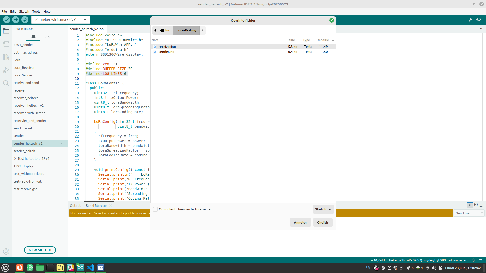
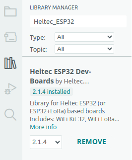
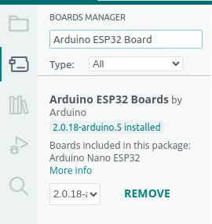
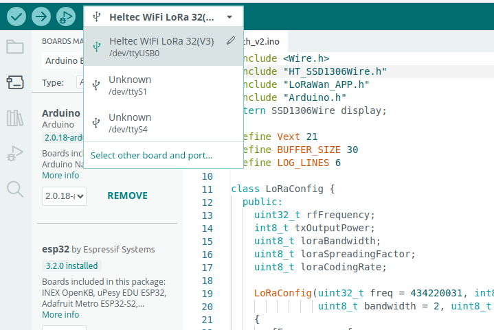
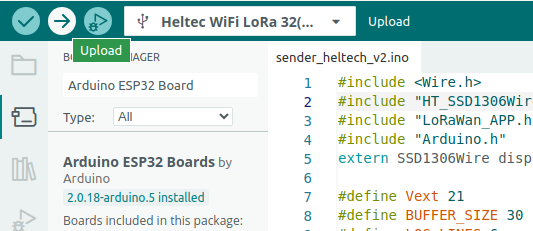

# 📥 Installing the Arduino IDE and Importing Sketches from GitHub

This guide explains how to:

1. Install the **Arduino IDE**
2. Import an **Arduino sketch** from **GitHub**
3. Use GitHub to find and clone other Arduino projects

---

## ✅ 1. Installing the Arduino IDE

### 🔗 Quick Method

- Visit the official website: [https://www.arduino.cc/en/software](https://www.arduino.cc/en/software)

- Follow the installer instructions to complete the installation.

> 💡 **Tip:** You can also use the **Arduino Web Editor** (no installation needed):  
> [https://create.arduino.cc/editor](https://create.arduino.cc/editor)

---

## 📁 2. Importing a Sketch from a GitHub Repository to Arduino IDE

### 🧭 Steps

1. **Clone using Git (advanced):**

   Make sure Git is installed. Then, in your terminal:

   ```bash
   git clone git@github.com:Luczerty/Lora-Testing.git

2. **Open your Arduino IDE**

On the top bar, go to File > Open, and select the file you want to import.



3. **Install the library**
Click on the library icon  and install the HelTech ESP32 Dev-Board



3. **Install the Board Manager**

Click on the icon below the folder icon and install the Arduino ESP32 Board.



You should see your board recognized in the top bar of the Arduino IDE:



If not, click on "Select other board", choose Heltec WiFi LoRa 32, and click OK.
5. **Upload it on your board**

Finally, click on Upload.



## 🔐 License Problem (Heltec LoRa Board)

If you encounter the following error:


Please provide a correct license! For more information:
http://www.heltec.cn/search/
ESP32ChipID=XXXXXXXXXXX


### ✅ Solution

1. Go to the official Heltec license page:  
   👉 [http://www.heltec.cn/search/](http://www.heltec.cn/search/)

2. Enter your `ESP32ChipID` to retrieve your license key.

3. Open the **Serial Monitor** in the Arduino IDE (baud: 115200).

4. Send the following command in the Serial input, replacing with your actual license values:
