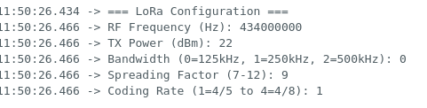
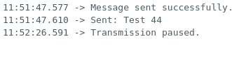

# 📡 LoRa Range Test Script – Heltec LoRa 32 V3

I had the opportunity to develop scripts for both transmitting and receiving LoRa packets in order to test the range of the **Heltec LoRa 32 V3** boards.

---

## 🛠️ Available Commands

### 1. `show` – Display Configuration 

Displays the current configuration of the LoRa board, including all radio settings.  



---

### 2. `restart` – Restart the Radio Module  
Restarts the LoRa radio module. Useful for applying changes or resolving transmission issues.  


---

### 3. `pause` / `resume` – Control Transmission  
Pauses or resumes the radio transmission without resetting the board.  




---

### 4. `set` – Configure LoRa Parameters  
You can customize the following radio parameters:

```cpp
set freq <433000000 - 450000000>   // Set frequency in Hz  
set bw <0-2>                        // Bandwidth: 0=125kHz, 1=250kHz, 2=500kHz  
set sf <7-12>                       // Spreading Factor  
set cr <1-4>                        // Coding Rate  
set power <0-21>                    // Transmit power in dBm  
```


